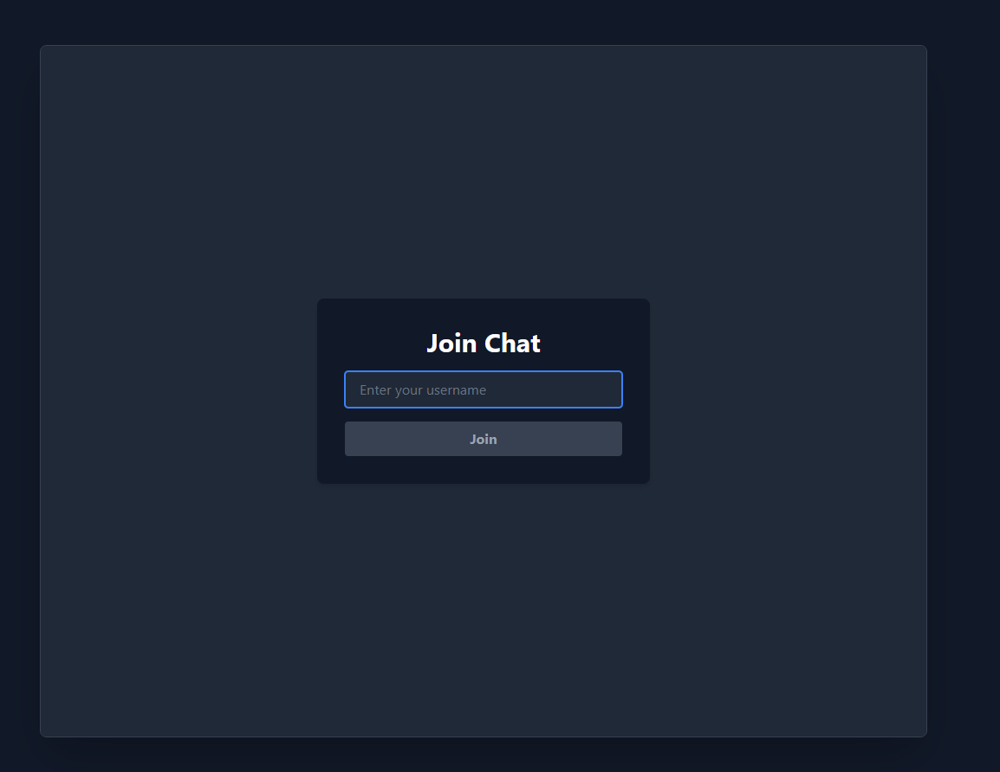
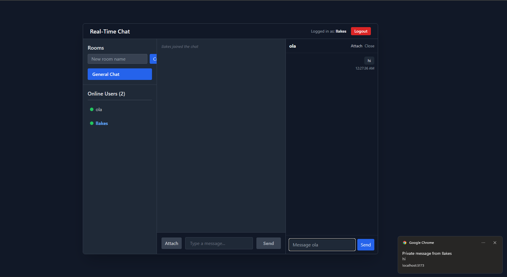
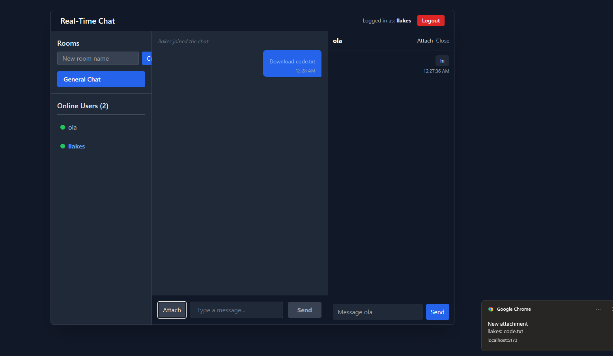

# Real-Time Chat Application with Socket.io

This repository is a real-time chat application (server + React client) built for the Week 5 assignment. It demonstrates bidirectional communication using Socket.io and includes several advanced chat features implemented during development.

## Implemented features (current state)
- Core:
  ## Real‑Time Chat App — Week 5 (server + React client)

  This project implements a real‑time chat application built for the Week 5 assignment. It demonstrates bidirectional communication using Socket.io and includes rooms, private chats, attachments, and desktop notifications.

  ### Quick summary of implemented features
  - Username‑based join/login screen and presence (online users)
  - Global room chat and multiple named rooms (create / join)
  - Private one‑to‑one chats (dedicated private chat panels)
  - Typing indicators and basic reconnection handling
  - File/image attachments for rooms and private chats
  - Browser notifications + short sound alert when the tab is hidden
  - In‑memory message history per room (demo only)

  If you need a short demo GIF or screenshots added here, tell me and I'll include them.

  ## How this maps to the Week 5 assignment

  Required pieces implemented:
  - Node + Express server with Socket.io (see `server/server.js`)
  - React front‑end scaffolded with Vite (`client/`)
  - Socket.io client integration and a reusable socket hook (`client/src/socket`)
  - Core chat flows: login, presence, messages with sender & timestamp, typing indicators

  Advanced features (at least three implemented):
  - Private messaging (one‑to‑one) using private chat panels
  - Multiple chat rooms (create and join)
  - File/image attachments (rooms and private chats)
  - Desktop/browser notifications and a short sound when messages arrive while unfocused

  Not implemented by design (optional / future work):
  - Persistent server storage (messages and attachments are stored in memory)
  - Read receipts or advanced delivery acknowledgements
  - Chunked uploads / large file handling

  ## Project layout

  ass/
  - client/        # React (Vite) front‑end
    - public/
    - src/
      - socket/    # socket hook, components and helper utilities
      - App.jsx
    - package.json
  - server/        # Node + Express + Socket.io server
    - server.js
  - Week5-Assignment.md

  ## Local development (quick start)

  Open two terminals (one for server, one for client). On Windows PowerShell:

  1) Start the server

  cd server; npm install; npm start

  2) Start the client

  cd client; npm install; npm run dev

  Open the URL Vite prints (usually http://localhost:5173) in two browser windows to test multi‑user flows.

  ## Main user flows to test

  - Join: enter a username on the join screen and click Join.
  - Rooms: create a room from the Rooms panel and click it to join — messages and attachments are scoped to the room.
  - Private chat: click a user in the Online Users list to open a private chat panel. Messages and attachments sent here go only to the selected peer.
  - Attachments: use the Attach button in the message input to send a file or image.
  - Notifications: allow browser notifications when prompted — if the tab is hidden the app shows a notification and plays a short beep for new messages/attachments.

  ## Developer notes & limitations

  - Attachments are transmitted as binary ArrayBuffers and stored in memory on the server for demo purposes. For production, store files in cloud storage (S3, CDN) and exchange URLs.
  - Message and attachment history is in‑memory per room and resets on server restart.
  - No chunking for large files; keep attachments small during testing.
  - Audio autoplay policies may require a user interaction before the short beep will play in some browsers.

  ## Troubleshooting

  - Client fails to connect: ensure the server is running and `VITE_SOCKET_URL` points to the correct address (default: http://localhost:5000).
  - Missing dependencies: run `npm install` in the folder that reports the error (client or server).
  - Socket events duplicated or stale listeners: make sure you're running the latest client build and that you haven't opened multiple tabs connected with the same username; the client hook performs listener cleanup on disconnect.

  If you hit an error, copy the server and client console output and paste it here and I will help debug.

 ## Screenshots / Demo
 
 
 
 
  ---

